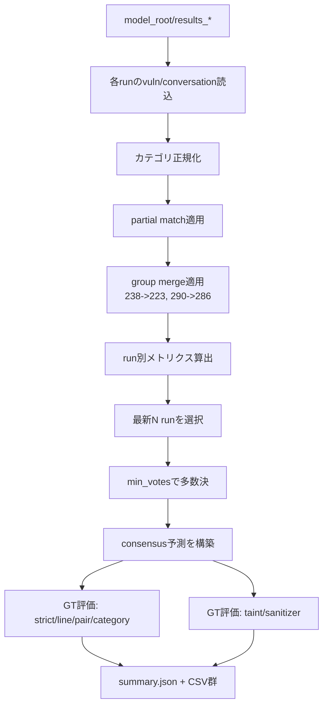
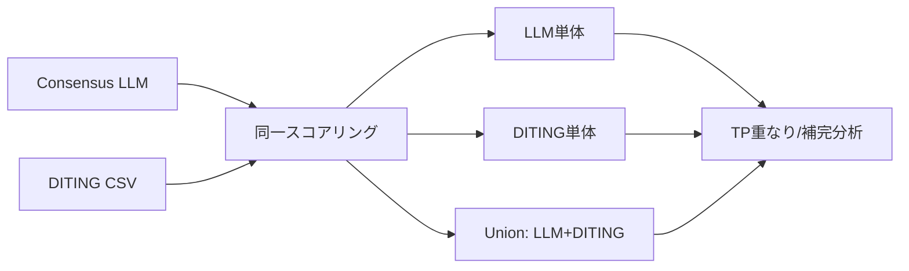

# 集計方法ドキュメント（Actual Evaluation）

> Public artifact scope: this release uses vulnerability line/category metrics,
> DITING complementarity, and candidate-chain coverage. Taint/sanitizer scoring
> and SCIS comparison remain optional legacy paths in the script, but their
> labels and derived outputs are not included in this repository.

## 1. 目的と対象
- 目的: 1モデルの `results_*` 複数回実行を多数決で統合し、GT（正解ラベル）に対する最終性能を算出する。
- 対象スクリプト: `run_actual_evaluation.py`（共通処理: `evaluation_common.py`）。
- 主な比較軸:
  - LLM単体（consensus）
  - LLM vs SCIS（任意、`--with-scis`、この artifact では除外）
  - LLM vs DITING / LLM+DITING（既定で有効、CSVが存在する場合）

## 2. 入力データ
- LLM実行結果（モデルルート配下）
  - `results_* / ta_vulnerabilities.json`
  - `results_* / conversations.jsonl`（または `ta_conversations.jsonl`, `conversations.json`, `ta_conversations.json`）
- 正解データ
  - `ground_truth_labels.csv`（行・カテゴリGT）
  - `partial_match_lines.csv`（検出行→GT行の部分一致マップ）
  - taint/sanitizer ラベルCSV群（任意。この artifact では除外）
- 補助データ
  - DITING: `DITING_ans.csv`
  - SCIS（任意）: `--scis-vuln`, `--scis-conversations`

## 3. 正規化と統合ルール

### 3.1 カテゴリ正規化
- 入力上の別名（`udo`, `ivw`, `dus` など）を、以下3カテゴリへ正規化:
  - `unencrypted_data_output`
  - `input_validation_weakness`
  - `direct_usage_of_shared_memory`
- `other` はカテゴリ評価対象外。ただし `line_only` では「行検出」として扱う。

### 3.2 partial match 適用
- `partial_match_lines.csv` は「Detected Line -> Related Ground Truth Line」対応。
- `(line, category)` のペア評価では、カテゴリ一致時のみ対応先GTペアへ写像。
- 行評価（line-only / strict）では行対応として利用。

### 3.3 手動統合ルール（group merge）
- 予測側（LLM/SCIS/DITING）のみ、以下を同一視する正規化を適用（既定ON）。
  - `238 -> 223`
  - `290 -> 286`
- 無効化: `--no-group-merge`

## 4. 指標定義

### 4.1 脆弱性
- `pair`: `(line, category)` 完全一致
- `line_only`: 行一致（カテゴリ無視）
- `strict_line_category`: 行ごとに「予測カテゴリ集合 ∩ GTカテゴリ集合 != ∅」ならTP
- `line_hit_category_precision`: `strict_tp / line_tp`
- `vulnerability_by_category`: 3カテゴリ別 TP/FP/FN/Precision/Recall/F1

### 4.2 Taint / Sanitizer
- taint:
  - 会話ログ中 `type=flow_conversations` のJSONから抽出
  - 変数名は正規化（添字一般化など）後に照合
- sanitizer:
  - `(function, line)` を抽出
  - 既定で ±2行許容（`--sanitizer-tolerance`）

## 5. マルチラン集計（consensus）
- 有効な `results_*` を番号順に取得。
- 最新 `N` 本（既定 `N=5`）を集計窓として利用。
- 多数決閾値 `min_votes`（既定3）で採択。
  - 実効値は `min(min_votes, consensus_window)`。
- 対象:
  - vulnerability pairs
  - vulnerability lines
  - taint items
  - sanitizer items



## 6. DITING 補完評価
- DITING CSVをプロジェクト名でフィルタ（既定: `bad-partitioning,badpartitioning`）。
- LLM側と同じ partial match / group merge を適用して公平化。
- 出力:
  - `diting_llm_gt_pair_breakdown.csv`
  - `diting_llm_bucket_characteristics.csv`
  - `diting_llm_prediction_overlap.csv`
  - `summary.json > diting_complementarity`



## 7. SCIS比較（任意）
- `--with-scis` 指定時のみ評価。
- SCISデータにも同じ正規化（partial/group merge）を適用。
- `summary.json > diff_vs_scis` と `scis_scores.json` を生成。

## 8. 主な出力物
- `summary.json`
- `per_run_metrics.csv`
- `consensus_pair_votes.csv`
- `ground_truth_consensus_hits.csv`
- `consensus_category_metrics.csv`
- （任意）`scis_scores.json`
- （DITING有効時）3種の `diting_llm_*.csv`

## 9. 代表コマンド
```bash
python3 /workspace/bad-partitiont-ta_actual_evaluation/run_actual_evaluation.py \
  /workspace/evaluation_processing/bad-partitioning/gpt-5-mini-2025-08-07 \
  --with-scis \
  --scis-vuln /workspace/SCIS2026-bad-partitioning-ta_LLMs_output/gpt5-mini-bad-partitioning/gpt-5-mini-ta_vulnerabilities.json \
  --scis-conversations /workspace/SCIS2026-bad-partitioning-ta_LLMs_output/gpt5-mini-bad-partitioning/gpt-5-mini-conversations.jsonl
```
