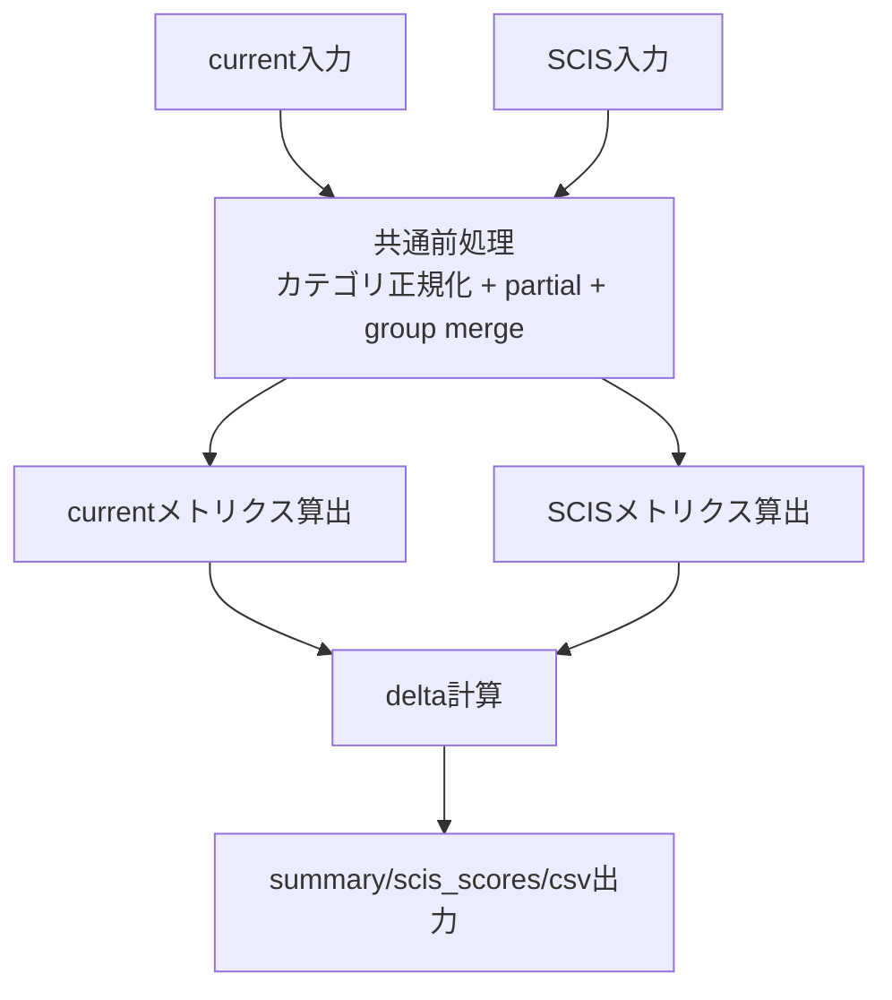
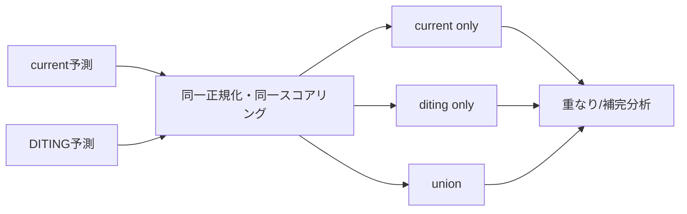

# 集計方法ドキュメント（Prompt Renovation）

## 1. 目的と対象
- 目的: 改修プロンプトの1実行結果（current）を、SCIS基準（既定: gpt-5-mini）と同一条件で比較評価する。
- 対象スクリプト: `run_prompt_renovation_eval.py`
- 比較軸:
  - current vs SCIS（差分/F1 verdict）
  - current vs DITING（任意、既定有効）

## 2. 入力データ
- current（評価対象）
  - `ta_vulnerabilities.json`（単体ファイル/`results_*`/モデルディレクトリ指定可）
  - conversations（`jsonl/json`、複数ファイル名対応）
- SCIS baseline
  - `--scis-vuln`
  - `--scis-conversations`
- 正解データ
  - `ground_truth_labels.csv`
  - `partial_match_lines.csv`
  - taint/sanitizer ラベルCSV群
- DITING
  - `DITING_ans.csv`

## 3. 正規化と統合ルール

### 3.1 カテゴリ正規化
- 別名カテゴリを以下3カテゴリへ統一:
  - `unencrypted_data_output`
  - `input_validation_weakness`
  - `direct_usage_of_shared_memory`

### 3.2 partial match
- `Detected Line -> Related Ground Truth Line` を適用。
- `(line, category)` はカテゴリ一致時のみGT対応先へ写像。

### 3.3 手動統合ルール（group merge）
- 既定で予測を以下へ正規化:
  - `238 -> 223`
  - `290 -> 286`
- 適用先: current / SCIS / DITING
- 無効化: `--no-group-merge`

## 4. 指標定義
- 脆弱性:
  - `strict_line_category`: 行ごとにカテゴリ集合が交差すればTP
  - `line_only`: 行一致
  - `line_hit_category_precision = strict_tp / line_tp`
  - `vulnerability_by_category`: カテゴリ別
- taint:
  - 会話ログから抽出、変数名正規化後に照合
- sanitizer:
  - `(function, line)` で照合（既定 ±2行許容）

## 5. 比較ロジック（current vs SCIS）
- current と SCIS を同一パイプラインで評価。
- `delta = current_f1 - scis_f1` を算出。
- verdict:
  - `improved`（delta > 0）
  - `regressed`（delta < 0）
  - `no_change`（delta = 0）



## 6. DITING補完評価
- current と DITING を同一スコアリングで比較。
- `LLM only / DITING only / Union` を算出し、GT上の重なりを集計。
- 生成物:
  - `diting_llm_gt_pair_breakdown.csv`
  - `diting_llm_bucket_characteristics.csv`
  - `diting_llm_prediction_overlap.csv`
  - `summary.json > diting_complementarity`



## 7. 主な出力物
- `summary.json`
- `scis_scores.json`
- `category_metrics_comparison.csv`
- `ground_truth_hit_comparison.csv`
- `prediction_diffs.csv`
- `taint_sanitizer_comparison.csv`
- （DITING有効時）`diting_llm_*.csv`

## 8. 代表コマンド
```bash
python3 /workspace/bad-partitiont-ta_pronpt_renovation/run_prompt_renovation_eval.py \
  /workspace/benchmark/partitioningE/bad-partitioning/ta/gpt-5-mini-2025-08-07/results_5 \
  --scis-vuln /workspace/SCIS2026-bad-partitioning-ta_LLMs_output/gpt5-mini-bad-partitioning/gpt-5-mini-ta_vulnerabilities.json \
  --scis-conversations /workspace/SCIS2026-bad-partitioning-ta_LLMs_output/gpt5-mini-bad-partitioning/gpt-5-mini-conversations.jsonl
```
